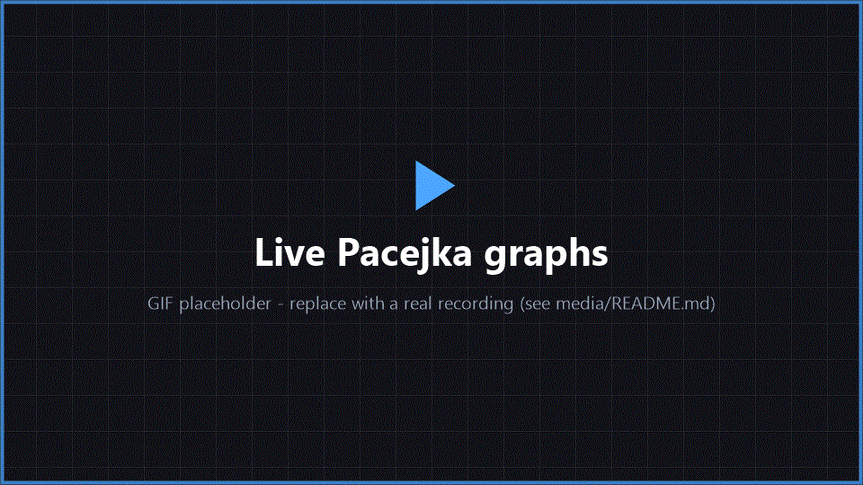
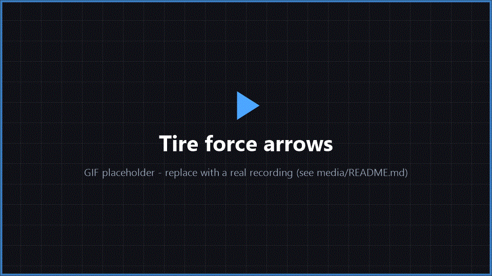
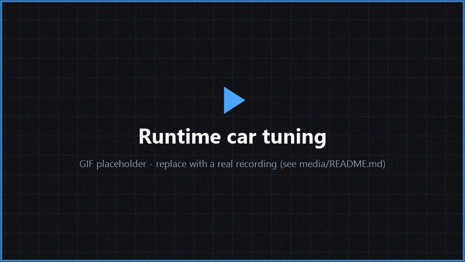
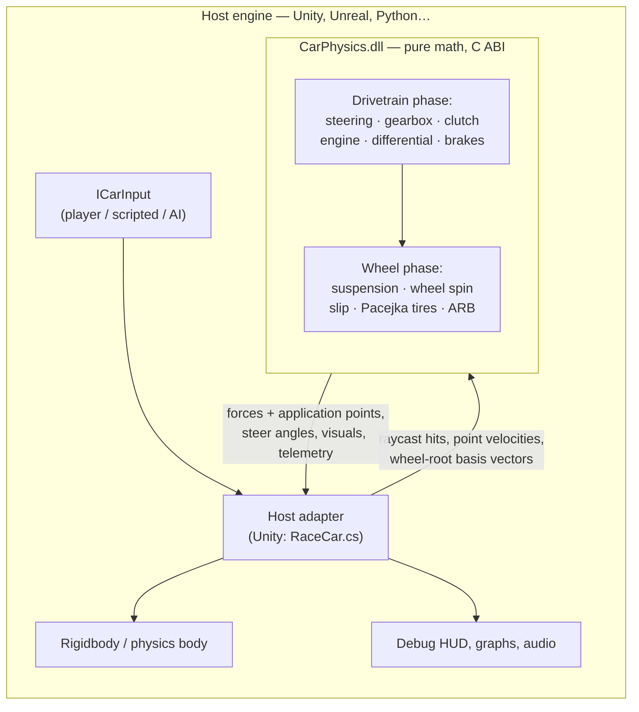

# CarPhysics — cross-engine vehicle simulation core

**A realistic car-physics module written as a pure-math C++ library with a plain C ABI, plus a Unity (HDRP) host that drives it.** The DLL knows nothing about any game engine: the host feeds it raycasts, velocities and wheel transforms, and gets back forces, steering angles, wheel visuals and full telemetry. The same binary can be consumed from Unity (P/Invoke), Unreal (C++), or a Python test harness (ctypes).


## Features

- **Engine-agnostic core** — data-in / data-out design: no raycasts, no force application, no transforms inside the DLL. Everything engine-specific stays in a thin host adapter.
- **Complete drivetrain** — torque-curve engine, manual gearbox with shift time, slipping clutch, differential (open / locked / LSD, FWD / RWD / AWD with torque split), speed-sensitive brakes and handbrake.
- **Pacejka Magic Formula tires** — independent longitudinal and lateral curves with configurable peak slip, shape and curvature factors, combined-slip friction ellipse, camber thrust and slip-angle relaxation.
- **Suspension & chassis** — spring-damper suspension driven by host raycasts, anti-roll bars, Ackermann steering with lateral-acceleration correction.
- **Numerically stable wheel spin** — the longitudinal tire reaction is integrated implicitly (linearised around the current wheel speed), so wheels do not oscillate or blow up at fixed timesteps.
- **Live debug tooling** — code-generated HUD with real-time Pacejka curve plots and the live operating point, suspension force graphs, 3D tire-force arrows at contact patches, gear/RPM/speed telemetry and input display.
- **Runtime tuning** — every chassis parameter (springs, tires, alignment, drivetrain, ARB) editable from an in-game panel; the native sim rebuilds on the fly.
- **Multi-car test scenarios** — spawn dozens of self-driving cars (grid / line / circle formations) to stress-test physics and performance. See [docs/scenarios.md](docs/scenarios.md).

## Showcase

| Live Pacejka curves & suspension graphs | Tire forces at the contact patch |
| :---: | :---: |
|  |  |
| **Runtime car tuning** | **Multi-car stress scenario** |
|  |  |

## Architecture



The host calls two functions per fixed tick: `carsim_update_drivetrain` (input → steer angles + drivetrain state), then — after applying steering and doing its raycasts — `carsim_update_wheels` (contact data → forces + visuals). All vectors are expressed in the host's own coordinate system, so the core is even coordinate-convention agnostic.

Full details: [docs/api.md](docs/api.md) · [docs/integration.md](docs/integration.md)

## Repository layout

```
├── Assets/                  Unity host project (HDRP)
│   ├── Plugins/x86_64/      CarPhysics.dll (prebuilt native module)
│   └── Scripts/
│       ├── Car/             RaceCar adapter, P/Invoke binding, CarDesc config
│       ├── Core/            ICarInput, InputManager, scene bootstrap
│       ├── Scenarios/       multi-car test scenarios
│       └── UI/Debug/        code-generated debug HUD, graphs, tuning panel
├── Native/CarPhysics/       native simulation core (VS2022 solution)
│   ├── include/             car_physics.h — public C ABI
│   └── src/                 models, orchestrator, exported API
└── docs/                    API reference, integration guide, scenarios
```

## Quick start

**Requirements:** Unity **6000.4.5f1** (HDRP), Windows x64. The native DLL ships prebuilt in `Assets/Plugins/x86_64` — no C++ toolchain needed just to run.

1. Clone and open the project in Unity.
2. Open `Assets/Scenes/Main.unity` and press **Play**.

### Controls

| Action | Keyboard | Gamepad |
| --- | --- | --- |
| Throttle / brake | `W` / `S` | RT / LT |
| Steering | `A` / `D` | Left stick |
| Gear up / down | `E` / `Q` | RB / LB |
| Handbrake | `Space` | A / Cross |
| Clutch | `Alt` | X / Square |
| Camera | Mouse | Right stick |
| Toggle tuning mode (frees cursor) | `Ctrl` | — |
| Debug HUD on/off · wheel select | `F1` · `1–4` | — |

### Building the native DLL

Open `Native/CarPhysics/CarPhysics.sln` in Visual Studio 2022, build **Release x64**. A post-build step copies the fresh `CarPhysics.dll` into `Assets/Plugins/x86_64` automatically (restart the Unity editor to reload a native DLL).

## Physics model at a glance

| Subsystem | Model |
| --- | --- |
| Engine | Torque curve × throttle − friction, integrated with engine inertia; RPM-limited |
| Clutch | Slip-speed-proportional torque with lock-up map, capacity clamp and damping |
| Gearbox | Ratio table, timed shifts through neutral |
| Differential | Open / locked / LSD bias, FWD / RWD / AWD with front torque split |
| Brakes | Speed-sensitive torque curve, front/rear bias, rear handbrake |
| Steering | Ackermann geometry + lateral-acceleration correction, rate-limited |
| Suspension | Spring-damper on host raycast, anti-roll bars |
| Tires | Pacejka Magic Formula (per-axis B/C/D/E), friction-ellipse combined slip, camber thrust, slip-angle relaxation |
| Wheel spin | Semi-implicit integration of drive/brake/tire torques (unconditionally stable) |

## Documentation

| Document | Contents |
| --- | --- |
| [docs/api.md](docs/api.md) | Native library reference: every function and struct of the C ABI |
| [docs/integration.md](docs/integration.md) | How to host the core in any engine, with the per-tick flowchart |
| [docs/scenarios.md](docs/scenarios.md) | Multi-car test scenarios: presets, formations, driver profiles |

## License

Code is released under the [MIT License](LICENSE). Third-party art, audio and sound-engine assets bundled with the Unity demo remain under their respective licenses.
