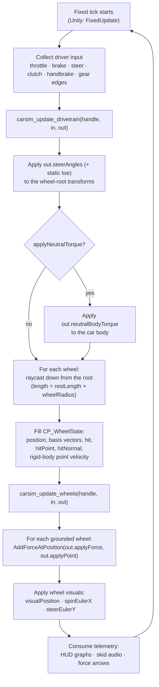

# Integrating the core into a host engine

The module is **data-in / data-out**: it contains only math. The host owns the physics body, the raycasts and the transforms, and is responsible for four things per fixed tick:

1. collect driver input;
2. apply the returned steering to the wheel roots;
3. raycast each wheel and read the body velocity at the contact;
4. apply the returned forces at the returned points.

Because the wheel orientation is passed in as three basis vectors (`right`, `up`, `forward`) rather than a quaternion or Euler angles, the module is agnostic to the host's coordinate conventions — Unity's left-handed Y-up, Unreal's left-handed Z-up and a plain NumPy harness all work unchanged.

## Per-tick flow



## Minimal host pseudo-code

```c
CP_CarConfig cfg = describe_car();            // fill once, arrays are deep-copied
CP_Handle sim = carsim_create(&cfg);

while (running) {                             // fixed timestep loop
    CP_DrivetrainInput din = read_input(dt);
    CP_DrivetrainOutput dout;
    carsim_update_drivetrain(sim, &din, &dout);

    for (int i = 0; i < 4; i++)
        set_wheel_root_yaw(i, dout.steerAngles[i] + static_toe[i]);
    if (dout.applyNeutralTorque)
        body_add_torque(dout.neutralBodyTorque);

    CP_WheelInput win = { dt };
    for (int i = 0; i < 4; i++)
        win.wheels[i] = raycast_wheel(i);     // position, basis, hit data, point velocity

    CP_WheelOutput wout;
    carsim_update_wheels(sim, &win, &wout);

    for (int i = 0; i < 4; i++) {
        if (win.wheels[i].hit)
            body_add_force_at(wout.applyForce[i], wout.applyPoint[i]);
        set_wheel_visual(i, wout.visualPosition[i], wout.spinEulerX[i], wout.steerEulerY[i]);
    }
}

carsim_destroy(sim);
```

## The Unity host, mapped to the flow

| Step | Where in this repo |
| --- | --- |
| P/Invoke binding, struct marshalling, curve sampling | [`Assets/Scripts/Car/CarPhysicsNative.cs`](../Assets/Scripts/Car/CarPhysicsNative.cs) |
| The whole per-tick loop above | [`Assets/Scripts/Car/RaceCar.cs`](../Assets/Scripts/Car/RaceCar.cs) — `FixedUpdate` |
| Car description asset (all `CP_*Info` fields) | [`Assets/Scripts/Car/Data/CarDesc.cs`](../Assets/Scripts/Car/Data/CarDesc.cs) + `Assets/Data/CarDesc.asset` |
| Car assembly: core prefab + visual + wheels | [`Assets/Scripts/Car/CarBuilder.cs`](../Assets/Scripts/Car/CarBuilder.cs) |
| Input abstraction | [`Assets/Scripts/Core/ICarInput.cs`](../Assets/Scripts/Core/ICarInput.cs) — implemented by `InputManager` (player) and `ScriptedCarInput` (scenarios/AI) |

Key host-side details worth copying into any other engine:

- **Curves.** Unity `AnimationCurve` uses Hermite interpolation; the binding samples it into a dense 64-point piecewise-linear table so the DLL's linear evaluation matches the editor curve.
- **Raycast length** is `restLength + wheelRadius` per wheel, cast straight down the wheel root's `-up`.
- **Point velocity** must be the body velocity **at the contact point** (`Rigidbody.GetPointVelocity(hit.point)`), not the body's centre velocity — suspension damping and slip depend on it.
- **Static toe** is added by the host to the steering angle on the wheel root, so slip and tire forces automatically follow the toed direction.
- **Gear shifts are edge-triggered.** Pass `1` in `gearUp`/`gearDown` only on the tick the request happened.
- **Live re-tuning.** To change car parameters at runtime, destroy the handle and create a new one from the updated config (see `RaceCar.RequestRebuild`).

## Hosting checklist for a new engine

- [ ] Fill `CP_CarConfig` (measure `wheelBase` / `rearTrack` from your wheel roots)
- [ ] Call `carsim_create`, keep the opaque handle
- [ ] Every fixed tick, run the two-phase update exactly in the order of the flowchart
- [ ] Express all vectors in your world space; supply the wheel-root basis after steering
- [ ] Apply forces at the returned contact points on your rigid body
- [ ] Call `carsim_destroy` on teardown
