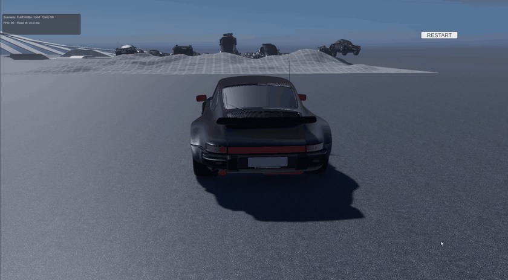
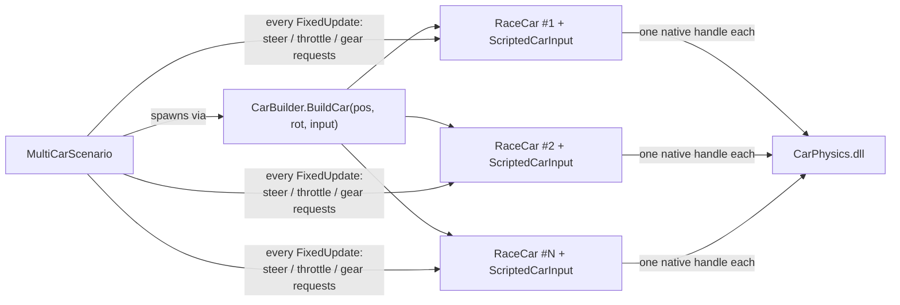

# Multi-car test scenarios

`MultiCarScenario` spawns a fleet of self-driving cars, each with its **own native simulation instance** and its own `ScriptedCarInput`. It is the quickest way to stress-test the physics module and to demo that the core scales beyond a single player car.

## Running a scenario

1. Open `Assets/Scenes/Main.unity`.
2. Create an empty GameObject where the fleet should spawn (a flat part of the test map) and add **Car → Scenarios → Multi Car Scenario**.
3. Assign `Car Desc` (use `Assets/Data/CarDesc.asset`).
4. Pick a preset: right-click the component header → **Preset: …**, or tune the fields manually.
5. Press **Play**. A stats box (car count, FPS, fixed dt) is drawn in the corner; spawn slots are previewed as gizmos while the object is selected.

> For clean stress runs you can disable the player-car bootstrap (`RaceCarState`) and the single-car debug HUD (`CarDebugHud`) in the scene — the scenario is fully self-contained.

## Presets

| Preset | Cars | Formation | Drivers |
| --- | --- | --- | --- |
| **Grid Rush** | 20 | 5×4 grid | Full throttle, auto-shifting |
| **Slalom Parade** | 36 | 6×6 grid | Sine-wave slalom, phase-shifted per car |
| **Circle Carnival** | 12 | Circle, tangent headings | Constant-steer circling |
| **Stress Test** | 100 | 10×10 grid | Full throttle, audio muted |

## Configuration

| Group | Field | Meaning |
| --- | --- | --- |
| Cars | `Car Count` | Number of cars to spawn |
| | `Car/Wheel Prefab Name` | `Resources` prefab names (defaults: `porsche` / `porscheWheel`) |
| Formation | `Formation` | `Grid`, `Line` or `Circle` |
| | `Cars Per Row`, `Spacing` | Grid/line geometry, m |
| | `Circle Radius` | Circle geometry, m |
| | `Spawn Height` | Drop height above the scenario transform, m |
| Driving | `Driver Profile` | `FullThrottle`, `Slalom`, `CircleRun` or `Idle` (parked — suspension-only load) |
| | `Throttle`, `Slalom*`, `Circle Steer` | Profile parameters |
| Auto gearbox | `Shift Up/Down Rpm` | RPM thresholds for the automatic shifter |
| Misc | `Mute Audio` | Disables engine & skid audio on scenario cars (recommended above ~20 cars) |
| | `Show Stats` | Corner overlay with car count and FPS |

## How it works

Every car is a normal `RaceCar` — the only difference from the player car is the `ICarInput` implementation behind it. The same mechanism fits AI drivers, input replays or network-synchronised cars.
